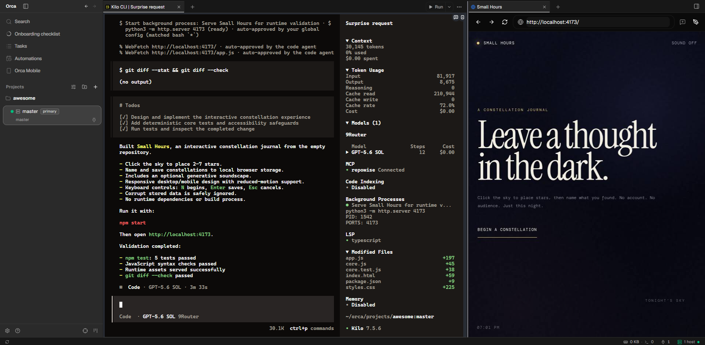
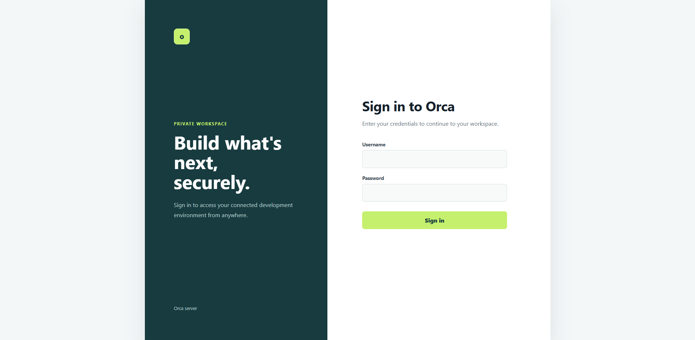
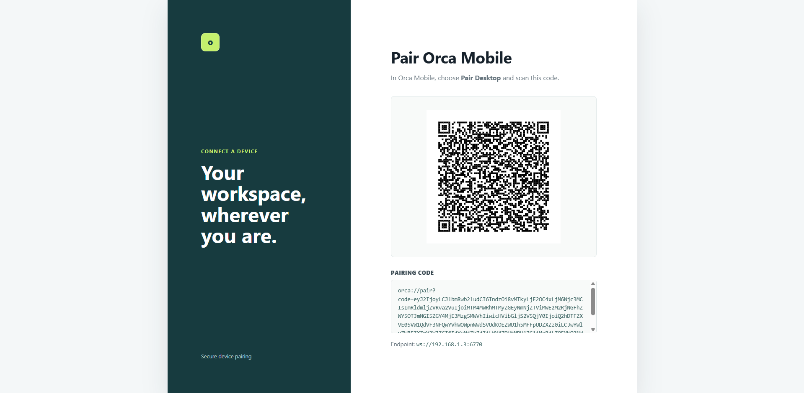
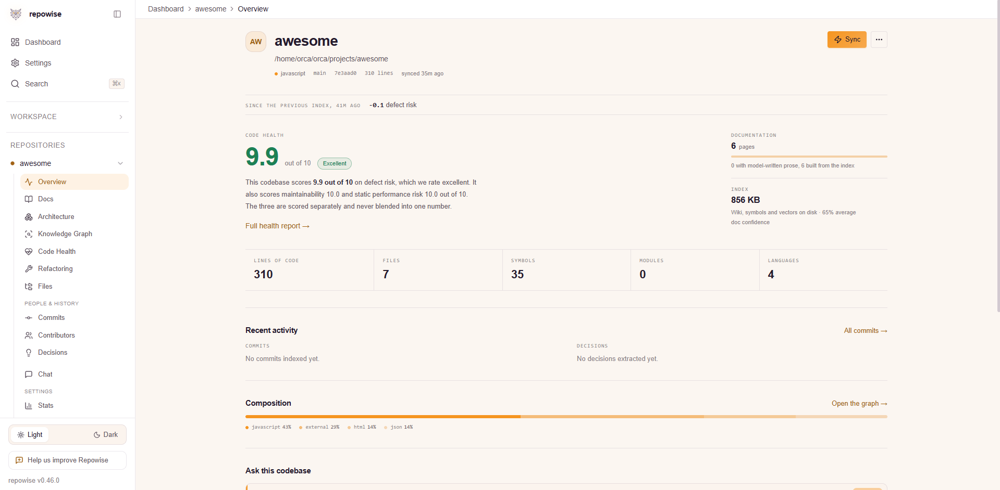
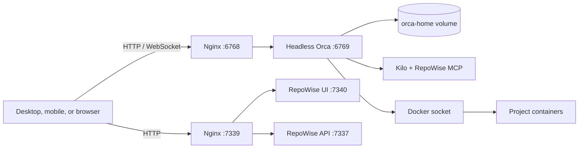

# Orca Remote Server

<div align="center">

**Run Orca as an always-on, private development workspace in Docker.**

Pair desktop and mobile clients, work from the browser, run project containers,
and give coding agents persistent tools and codebase context from one server.

[](https://www.onorca.dev/)
[](https://docs.docker.com/compose/)
[](#platforms)
[](https://repowise.dev/)

[Quick start](#quick-start) · [Architecture](#architecture) · [Configuration](docs/configuration.md) · [Operations](docs/operations.md) · [Security](docs/security.md)

</div>



## Why This Exists

Orca is normally a desktop application. This project packages its Linux AppImage into a
headless, unprivileged container so the workspace can stay online while clients come and go.
The persistent home volume keeps projects, worktrees, credentials, terminal history, and
agent configuration across rebuilds.

| Capability | What you get |
| --- | --- |
| Remote workspace | Authenticated Orca Web plus Desktop and Mobile pairing pages |
| Agent runtime | Kilo Code with a configurable OpenAI-compatible provider |
| Code intelligence | RepoWise MCP and an authenticated multi-repository dashboard |
| Project tooling | Git, GitHub CLI, Node.js, Docker CLI, Compose, and Buildx |
| Persistence | A named volume for projects, state, credentials, and user configuration |
| Portable image | Native builds for Linux `amd64` and `arm64`, including Docker Desktop |
| Safer runtime | Unprivileged user, no FUSE, and no container-level `--privileged` flag |

## Quick Start

### 1. Configure

```bash
cp .env.example .env
```

Set the required values:

```dotenv
ORCA_PAIRING_ADDRESS=192.168.1.4
ORCA_WEB_USER=orca
ORCA_WEB_PASSWORD=replace-with-a-long-random-password
GIT_USER_NAME=Your Name
GIT_USER_EMAIL=you@example.com
```

`ORCA_PAIRING_ADDRESS` must be reachable from the devices you want to pair. Use a private
LAN address, Tailscale address, or HTTPS reverse-proxy URL. On Linux, set `DOCKER_GID` to
the Docker socket group returned by `stat -c '%g' /var/run/docker.sock`. Docker Desktop
commonly uses `0`.

### 2. Start

```bash
docker compose up -d --build
docker compose ps
docker compose logs -f orca
```

### 3. Open

| Endpoint | Default URL | Authentication |
| --- | --- | --- |
| Orca Web | `http://localhost:6770` | `ORCA_WEB_USER` and `ORCA_WEB_PASSWORD` |
| Desktop pairing | `http://localhost:6770/desktop` | Orca Web credentials |
| Mobile pairing | `http://localhost:6770/mobile` | Orca Web credentials |
| RepoWise | `http://localhost:7339` | Orca Web credentials |

The Orca host port is configurable through `ORCA_PORT`. Pairing URLs and QR codes are
credentials; never publish them in screenshots, logs, issues, or browser sync.

## Product Tour

### Work From Anywhere

Orca Web exposes projects, worktrees, agent terminals, files, source control, checks, and
live workspace ports from a browser. The same server can pair with native Orca clients.

<details>
<summary><strong>Authenticated access screen</strong></summary>



</details>

<details>
<summary><strong>Mobile pairing screen</strong></summary>



</details>

### Understand Every Repository

RepoWise automatically discovers Git repositories under `/home/orca/orca/projects`, builds
missing deterministic indexes, and serves architecture, code health, history, ownership,
change-risk, and documentation views. Kilo receives the same context through local stdio MCP.



The API and frontend stay on container loopback. Nginx protects the public dashboard and
injects an ephemeral, startup-generated API key into private API requests.

## Architecture



The image extracts a pinned Orca AppImage without FUSE, starts it under the `orca` user,
and places Nginx in front of browser and pairing traffic. The mounted Docker socket uses
Docker-outside-of-Docker, so project containers run on the host engine and can join the
shared `orca-network`.

## Platforms

Set the target in `.env`:

```dotenv
# Intel/AMD hosts and most VPS instances
DOCKER_PLATFORM=linux/amd64

# ARM servers and Apple Silicon
DOCKER_PLATFORM=linux/arm64
```

```bash
docker compose build --pull
docker compose up -d --force-recreate orca
docker compose exec orca uname -m
```

Docker Desktop and `amd64` Linux hosts need binfmt enabled before cross-building ARM64:

```bash
docker run --privileged --rm tonistiigi/binfmt --install arm64
docker buildx inspect --bootstrap
```

## Configuration At A Glance

| Area | Important variables | Applied by |
| --- | --- | --- |
| Orca | `ORCA_VERSION`, `ORCA_PAIRING_ADDRESS`, `ORCA_PORT`, `TZ` | Rebuild or recreate |
| Access | `ORCA_WEB_USER`, `ORCA_WEB_PASSWORD` | Recreate |
| GitHub | `GIT_USER_NAME`, `GIT_USER_EMAIL`, `GH_TOKEN` | Recreate |
| Kilo | `KILO_BASE_URL`, `KILO_MODEL_ID`, `KILO_API_KEY` | Recreate |
| RepoWise | `REPOWISE_ENABLED`, `REPOWISE_VERSION` | Recreate or rebuild |
| Build | `NODE_VERSION`, `SKILLS_CLI_VERSION`, `DOCKER_GID` | Rebuild or recreate |

See the [configuration reference](docs/configuration.md) for every variable, default,
provider examples, account setup, and version behavior.

## Common Commands

```bash
# Service health and logs
docker compose ps
docker compose logs -f orca

# Inspect bundled integrations
docker compose exec orca kilo mcp list
docker compose exec orca kilo debug config
docker compose exec orca gh auth status

# Verify Docker access from Orca
docker compose exec orca docker version
docker compose exec orca docker compose version
```

Operational recipes for project containers, application ports, backup, restore, upgrade,
and troubleshooting live in the [operations guide](docs/operations.md).

## Security Model

This is a private development environment, not a multi-tenant sandbox.

- Put Orca behind Tailscale, WireGuard, SSH forwarding, or an authenticated TLS proxy.
- Do not expose the raw service directly to the public Internet.
- Treat pairing links, QR codes, access tokens, and the persistent home volume as secrets.
- Restrict `GH_TOKEN` and provider keys to the minimum permissions required.
- Only allow trusted users and agents: Docker socket access is effectively root-level host access.
- Use HTTPS whenever traffic leaves a trusted private network.

Read [security and deployment guidance](docs/security.md) before exposing this service beyond
localhost.

## Repository Layout

```text
.
|-- docker/
|   |-- entrypoint.sh          # Startup, rendered config, pairing, and lifecycle
|   |-- kilo/kilo.jsonc        # Provider-neutral Kilo template
|   |-- nginx/nginx.conf       # Authenticated Orca and RepoWise proxies
|   |-- repowise-dashboard.py  # Repository discovery and dashboard lifecycle
|   `-- web/                   # Login, landing, pairing, and compatibility assets
|-- docs/
|   |-- configuration.md
|   |-- operations.md
|   |-- security.md
|   `-- screenshots/
|-- .env.example
|-- Dockerfile
|-- docker-compose.yml
`-- README.md
```

## Documentation

| Guide | Covers |
| --- | --- |
| [Configuration](docs/configuration.md) | Environment variables, Kilo, RepoWise, GitHub, managed agents |
| [Operations](docs/operations.md) | Project containers, ports, backup, upgrades, troubleshooting |
| [Security](docs/security.md) | Trust model, reverse proxies, credentials, Docker socket risk |
| [Remote Orca Servers](https://www.onorca.dev/docs/remote-servers) | Official remote server concepts |
| [Headless Linux Server](https://github.com/stablyai/orca/blob/main/docs/reference/headless-linux-server.md) | Official headless deployment reference |

## License

Orca and RepoWise are installed from their respective upstream distributions. Review their
terms before redistributing an image built from this project.
